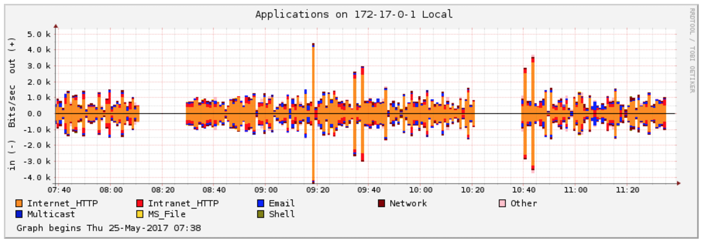
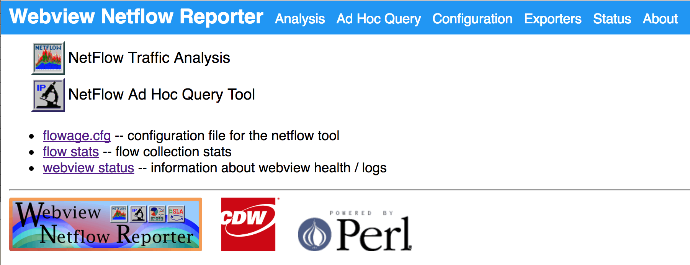
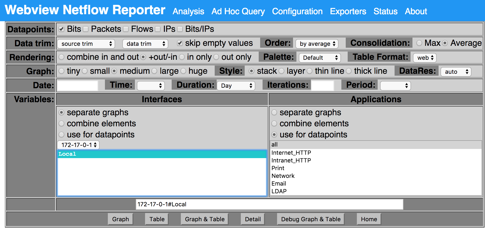

# Overview - Webview Netflow Reporter

A lightweight NetFlow collector and web display tool based on wvnetflow and flow-tools in a Docker container. **Webview Netflow Reporter** was created by [Craig Weinhold](craig.weinhold@cdw.com).

This container listens on port 2055 for NetFlow exports and displays the collected data in a web interface.



There is much more information in the `docs` directory, and on the original [wvnetflow](http://wvnetflow.sourceforge.net/) site hosted at [SourceForge.net](SourceForge.net)

_Current Version: wvnetflow v1.0.7d (latest version as of 2013)_

## QuickStart - Installation and Setup

### Prerequisites

* [Docker](https://www.docker.com/) must be installed on the system where you’ll run Webview Netflow Reporter.
* Docker Compose is optional but recommended for managing the container setup more easily.

### Steps

1. **Clone the Repository**

    Clone the `wvnetflow-dockerized` repository to your computer:

    ```sh
    git clone https://github.com/richb-hanover/wvnetflow-dockerized.git
    cd wvnetflow-dockerized
    ```

2. **Choose a Setup Method**

    * **Using Docker CLI**

        Build the container with the name `wvnr_img` and start it with the following commands:

        ```sh
        docker build -t wvnr_img .
        docker run -d -p 83:80 -p 2055:2055/udp --name wvnr_img wvnr_img
        ```

    * **Using Docker Compose**

        If you prefer Docker Compose, a `docker-compose.yml` file is provided. Open it and update the volume path `/path/to/your/netflow` to a directory where you want NetFlow data to be stored on your system, then start the container:

        ```sh
        docker compose up -d
        ```

3. **Access the Web Interface**

    Once the container is running, go to http://localhost:83 (or use the IP address of your Docker host if accessing from a different device).

    

4. **Configure Your Router to Export NetFlow Data**

    Set up your router or device to send NetFlow v5 data to port 2055 of the Docker host.

5. **Allow Time for Data Collection**

    It may take 5-15 minutes for data to appear in the interface.

## Quick Start - Home page

This information describes the links in the header bar. Read the `docs` and [wvnetflow](http://wvnetflow.sourceforge.net/) page for more details.

1. [Analysis](http://localhost:83/webview/flow/render.cgi) provides a GUI to select which traffic to chart. 
See the Traffic Analysis screen shot below for details.
(The container must run and receive flow records for at least 5-15 minutes before traffic can be graphed.)

2. [Ad Hoc Query](http://localhost:83/webview/flow/adhoc.cgi) lets you build queries to view the netflow data in different ways.

3. [Configuration](http://localhost:83/webview/flow/configdump.cgi) shows the configuration file for the /usr/local/webview/flowage/flowage.pl program that drives wvnetflow.
 
4. [Exporters](http://localhost:83/webview/flow/exporter.cgi) lists the exporters that are providing netflow data.

5. [Status](http://localhost:83/webview/flow/weblog.cgi) displays running statistics about the wvnetflow server. It will take up to five minutes before the **Flowage Activity Log** shows entries. 

6. [About](https://github.com/richb-hanover/wvnetflow-dockerized) leads to the github page that hosts the repository.

## Traffic Analysis

The GUI for creating and displaying netflow data has many controls. 
To see the most recent data received, use the defaults, and:

* Click the `Local` exporter (in Interfaces section)
* Select a duration ("Day" in the image)
* Click "Graph" to display the data. 

    

## Managing the Container

### Accessing the Container Shell

To open a terminal session within the container, use:

```sh
docker exec -it wvnr_img /bin/bash
```

### Updating the Container

If you make changes to the Dockerfile:

1. **With Docker CLI**

    Stop and remove the current container, rebuild, and run:

    ```sh
    docker rm -f wvnr_img
    docker build -t wvnr_img .
    docker run -d -p 83:80 -p 2055:2055/udp --name wvnr_img wvnr_img
    ```

2. **With Docker Compose**

    Use the following commands to update and restart the container:

    ```sh
    docker compose down
    docker compose up --build -d
    ```

### Verifying Port Mappings

Confirm that the container’s internal ports (2055 & 80) are mapped correctly:

```sh
docker port wvnr_img
```

Expected output:

```sh
2055/udp -> 0.0.0.0:2055
80/tcp -> 0.0.0.0:83
```

If you’re using `docker compose`, ensure the port mappings in `docker-compose.yml` match your intended setup.

## Known Issues/Questions

1. **Single Exporter Limitation**

    This program is designed to listen for NetFlow data from a single physical exporter device on port 2055. In a typical home networking setup, where flows come from a single router managing the network’s connection to the ISP, this works well to capture network activity and analyze traffic usage.

    However, if flows are sent from multiple devices to the container (e.g., multiple routers or switches), the current Docker networking configuration may not distinguish between the sources, potentially affecting data accuracy. Using multiple interfaces from a single device to send flows (e.g., LAN, guest, and WAN interfaces on the same router) should work as expected.

2. **Local vs. Remote Address Distinction**

    By default, this container treats all private (RFC1918) IP ranges—such as 10.0.0.0/8, 172.16.0.0/12, 192.168.0.0/16, and 224.0.0.0/4—as "local" traffic, while all other IPs are considered "remote." This distinction helps the Applications graph display "in" and "out" traffic accurately, especially in a home network environment with a single router. This behavior can be modified by adjusting the `/usr/local/webview/flowage/flowage.cfg` file.

3. **Data Refresh Interval**

    The `flowage.pl` program runs every five minutes, so the graphs might reflect data that is up to 10 minutes old. For setups with a single exporter and lower traffic volumes, decreasing this interval may make the charts more current. Be cautious about lowering the interval in high-traffic environments or with multiple exporters, as it could increase the processing load significantly.

4. **Source Code**

    The current source code for `wvnetflow` is hosted at https://github.com/richb-hanover/wvnetflow.
